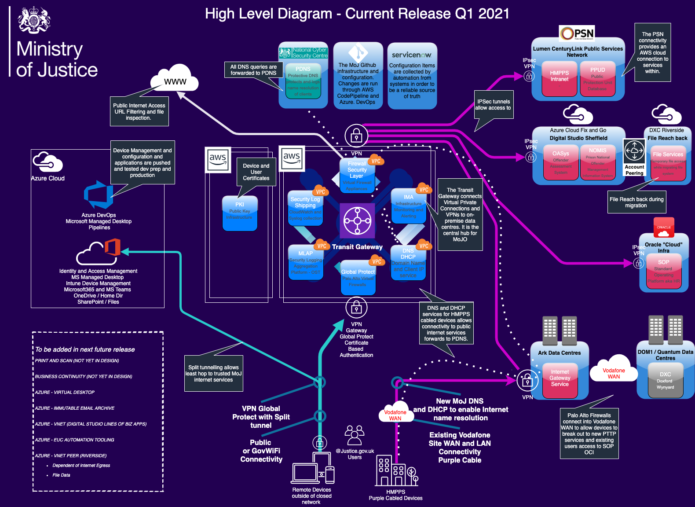
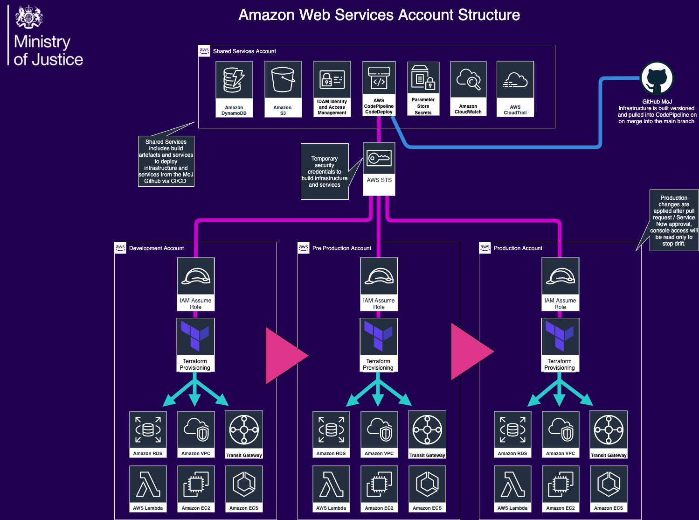

# Ministry of Justice Official - Staff Infrastructure and Devices

## About this repository

This is a list of repositories used by MoJ Official to deploy infrastructure and configure devices. 

### Amazon Web Services Deployment

- [Shared Services Infrastructure](https://github.com/ministryofjustice/staff-device-shared-services-infrastructure) - Used to create AWS CodePipelines for our services.
- [Docker Container base Images](https://github.com/ministryofjustice/staff-device-docker-base-images) - Container Images repository in AWS ECR.

### Azure Landing Zone

- [Azure DevOps Pipeline](https://github.com/ministryofjustice/staff-infrastructure-azure-landing-zone) - Build and maintain Azure Landing Zone.

### Certificate Services

- [Public Key Infrastructure](https://github.com/ministryofjustice/staff-infrastructure-certificate-services) - Public Key Infrastructure for devices and users. This repository only deploys the AWS resources, such as VPC, Security groups, EC2 instances which Entrust build their managed service on.

### Device Management

- [Windows 10 Configuration](https://github.com/ministryofjustice/staff-device-management-windows10-configuration) - Intune Windows Configuration.
- [Windows 10 Applications](https://github.com/ministryofjuestice/staff-device-management-windows10-apps) - Intune Windows Applications.
- [iOS Configuration](https://github.com/ministryofjustice/staff-device-management-ios-configuration) - iOS Configuration.
- [iOS Applications](https://github.com/ministryofjustice/staff-device-management-ios-apps) - iOS Applications.
- [Windows Virtual Desktop](https://github.com/ministryofjustice/staff-device-management-virtualdesktop) - WVD - Windows Virtual Desktop.

### DHCP / DNS

- [DHCP Server ECR Image](https://github.com/ministryofjustice/staff-device-dhcp-server) - Creates the AWS ECR container image for ISC Kea.
- [Admin console for DHCP and DNS](https://github.com/ministryofjustice/staff-device-dns-dhcp-admin) - Frontend for managing staff device site dhcp dns.
- [Provision infrastructure](https://github.com/ministryofjustice/staff-device-dns-dhcp-infrastructure) - Code to build the AWS infrastructure for the DNS and DHCP platform.
- [Disaster Recovery runbook](https://github.com/ministryofjustice/staff-device-dns-dhcp-disaster-recovery) -This repo contains an interactive script which can be used to roll back a corrupt config file for the DNS or DHCP services.
- [Staff Device DNS / DHCP / Logging integration tests](ministryofjustice/staff-device-logging-dns-dhcp-integration-tests) -These scripts emulate UDP traffic for both DHCP and Syslog requests. They are run from the Corsham VM to test the services over the network.

### Infrastructure Monitoring and Alerting

- [App Reachability](https://github.com/ministryofjustice/staff-infrastructure-monitoring-app-reachability) - Container to remote write blackbox http application prometheus metrics.
- [Blackbox Exporter](https://github.com/ministryofjustice/staff-infrastructure-monitoring-blackbox-exporter) - To probe endpoints over HTTP, HTTPS, DNS, TCP and ICMP.
- [DNS Reachability](https://github.com/ministryofjustice/staff-infrastructure-monitoring-dns-reachability) - Container to remote write blackbox DNS prometheus metrics.
- [Data Source Configuration](https://github.com/ministryofjustice/staff-infrastructure-monitoring-config) - To provision data sources for the IMA Platform.
- [Helm Charts](https://github.com/ministryofjustice/staff-infrastructure-monitoring-deployments) - Deploy helm charts to EKS
- [IMA Platform](https://github.com/ministryofjustice/staff-infrastructure-monitoring) - Infrastructure Monitor and alerting.
- [Metric Aggregation Server](https://github.com/ministryofjustice/staff-infrastructure-metric-aggregation-server) - To pull data from the SNMP exporter (Docker image)
- [Private DNS Zone](https://github.com/ministryofjustice/staff-device-private-dns-zone) - Route53 DNS zone
- [SNMP Exporter](https://github.com/ministryofjustice/staff-infrastructure-monitoring-snmpexporter) - To scrape data from physical devices (Docker image)

### Network Assessment

- [Network Assessment Tooling](https://github.com/ministryofjustice) - Information on the tooling and resources used to verify prison site readiness

### Security Log Aggregation and Shipping

- [Log Shipping Infrastructure](https://github.com/ministryofjustice/staff-device-logging-infrastructure) - Log shipping to infrastructure > OST
- [Syslog to CloudWatch](https://github.com/ministryofjustice/staff-device-logging-syslog-to-cloudwatch) - Syslog to aws cloudwatch > OST

### SMTP Relay Service

- [SMTP Relay Configuration](https://github.com/ministryofjustice/staff-infrastructure-smtp-relay-server)
- [Network Services Deployment](https://github.com/ministryofjustice/staff-infrastructure-network-services)

### Palo Alto Global Protect

- [GlobalProtect FW EC2 Deployment](https://github.com/ministryofjustice/deployment-GlobalProtect) - GlobalProtect firewall deployment
- [GlobalProtect ASG Deployment](https://github.com/ministryofjustice/deployment-GlobalProtect-ASG) - GlobalProtect Autoscale Deployment
- [GlobalProtect lambda functions](https://github.com/ministryofjustice/terraform-aws-step_function_globalprotect) - GlobalProtect lambda functions
- [Panorama Configuration](https://github.com/ministryofjustice/terraform-panorama-config) - Panorama Config written in Terraform
- [Public Services Network](https://github.com/ministryofjustice/deployment-PSN) - Public Services Network connection in AWS, connected via Lumen (previously CenturyLink)

### Transit Gateway

- [AWS Transit Gateway Configuration](https://github.com/ministryofjustice/terraform-aws-tgw) - AWS transit gateway deployment configuration
- [AWS Transit Gateway Deployment](https://github.com/ministryofjustice/deployment-tgw) - AWS transit gateway deployment
- [AWS Transit Gateway Configuration Cloud Platform](https://github.com/ministryofjustice/transit-gateways) - AWS transit gateway configuration that is now managed by TechOps. This was previously managed by Cloud Platform.

### Tags for Application and Services

List of our applications and services which we use to identify and tag our resources.

| Tag             | Value                                              |
| --------------- | ---------------------------------------------------|
| `application`   | `azure-landing-zone`                               |
| `application`   | `certificate-services`                             |
| `application`   | `dhcp-dns`                                         |
| `application`   | `infrastructure-monitoring`                        |
| `application`   | `internet-gateway-service`                         |
| `application`   | `security-log-shipping`                            |
| `application`   | `standard-operating-platform`                      |
| `application`   | `global-protect`                                   |
| `application`   | `transit-gateway`                                  |
| `application`   | `public-services-network`                          |

Mandatory Tags

| Tag             | Value                                              |
| --------------- | ---------------------------------------------------|
| `application`   | `<applicaiton>`                                    |
| `business-unit` | `HQ`                                               |
| `is-production` | `true or false`                                    |
| `owner`         | `<team-name>: <team-email> cloud-ops or tech-ops`  |

Optional Tags

| Tag                      | Value                                                     |
| ------------------------ | --------------------------------------------------------- |
| `environment-name`       | `production, staging, test, or development`               |
| `component`              | `API Gateway`                                             |
| `infrastructure-support` | `<team-name>: <team-email>`                               |
| `runbook`                | `The URL of the service’s runbook.`                       |
| `source-code`            | `The URL(s) for any source code repositories related to this infrastructure, comma separated.` |

Please see [Documenting owners of infrastructure](https://ministryofjustice.github.io/technical-guidance/documentation/standards/documenting-infrastructure-owners.html#documenting-owners-of-infrastructure) within MoJ Technical Guidance for more information on tagging.

### High Level Diagram

[image source](diagrams/hld-diagrams.drawio)

### AWS Account Structure and Deployment Diagram

[Image Source](diagrams/hld-diagrams.drawio)
