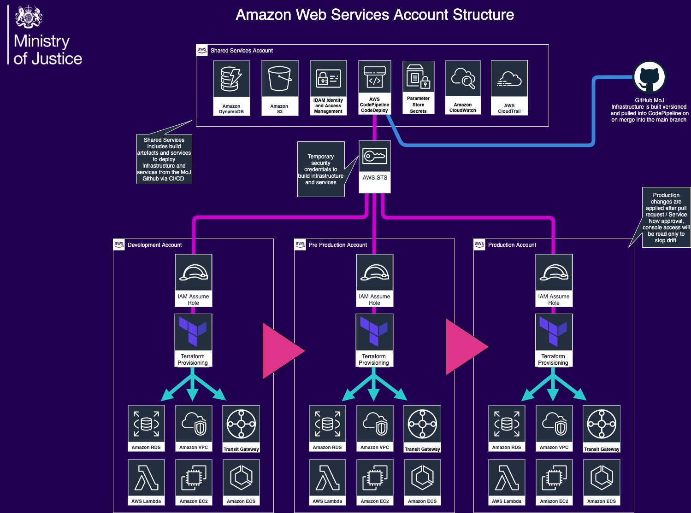

# Ministry of Justice Official Staff Infrastructure and Devices

## About this repository

Repositories used for MoJ Official infrastructure, staff device configuration,provisioning and management.

### Environment Deployments

[Image Source](diagrams/hld-diagrams.drawio)

- [Shared Services Infrastructure](https://github.com/ministryofjustice/staff-device-shared-services-infrastructure) - to create infrastructure from the main AWS shared account into Dev, Prep and Production via AWS CodePipelines
- [Elastic Container Registry](https://github.com/ministryofjustice/staff-device-docker-base-images) - AWS Base container images used across mulitple services

### Infrastrastructure Monitoring and Alerting

- [IMA Platform](https://github.com/ministryofjustice/staff-infrastructure-monitoring) - to monitor MoJO infrastructure and physical devices
- [Data Source Configuration](https://github.com/ministryofjustice/staff-infrastructure-monitoring-datasource-config) - to provision data sources for the IMA Platform
- [SNMP Exporter](https://github.com/ministryofjustice/staff-infrastructure-monitoring-snmpexporter) - to scrape data from physical devices (Docker image)
- [Blackbox Exporter](https://github.com/ministryofjustice/staff-infrastructure-monitoring-blackbox-exporter) - to probe endpoints over HTTP, HTTPS, DNS, TCP and ICMP (Docker image)
- [Metric Aggregation Server](https://github.com/ministryofjustice/staff-infrastructure-metric-aggregation-server) - to pull data from the SNMP exporter (Docker image)

### DHCP / DNS

- [DHCP Server ECR Image](https://github.com/ministryofjustice/staff-device-dhcp-server) - creates the AWS ECR container image for ISC Kea
- [Admin console for DHCP and DNS](https://github.com/ministryofjustice/staff-device-dns-dhcp-admin) - frontend for managing staff device site dhcp dns
- [Provision infrastructure](https://github.com/ministryofjustice/staff-device-dns-dhcp-infrastructure) - code to build the AWS infrastructure for the DNS and DHCP platform

### Security Log Shipping

- [Log Shipping Infrastructure](https://github.com/ministryofjustice/staff-device-logging-infrastructure) - log shipping infrastructure
- [Syslog to CloudWatch](https://github.com/ministryofjustice/staff-device-logging-syslog-to-cloudwatch) - syslog to aws cloudwatch

### Palo Alto Transit Gateway deployment

- [GlobalProtect FW EC2 Deployment](https://github.com/ministryofjustice/deployment-GlobalProtect) - GlobalProtect firewall deployment
- [GlobalProtect lambda functions](https://github.com/ministryofjustice/terraform-aws-step_function_globalprotect) - GlobalProtect lambda funtions
- [AWS Transit Gateway](https://github.com/ministryofjustice/deployment-tgw) - aws transit gateway deployment
- [Panorama Configuration](https://github.com/ministryofjustice/terraform-panorama-config) - Panorama Config written in Terraform
- [Public Services Network](https://github.com/ministryofjustice/deployment-PSN) - Public Services Network connection in AWS, connected via Lumen (previously CenturyLink)

### Azure Landing Zone

- [Azure DevOps Pipeline](https://github.com/ministryofjustice/staff-infrastructure-azure-landing-zone) - azure devops pipeline configuration for staff device management.

### Device Management

- [Windows 10 Configuration](https://github.com/ministryofjustice/staff-device-management-windows10-configuration)
- [Windows 10 Applications](https://github.com/ministryofjustice/staff-device-management-windows10-apps)
- [Intune iOS Configuration](https://github.com/ministryofjustice/staff-device-management-ios-configuration)
- [Intune iOS Applications](https://github.com/ministryofjustice/staff-device-management-ios-apps)
- [Windows Virtual Desktop](https://github.com/ministryofjustice/staff-device-management-virtualdesktop)
- [Intune Configuration](https://github.com/ministryofjustice/moj-official-intune)

### Certificate Services

- [Public Key Infrastructure](https://github.com/ministryofjustice/staff-infrastructure-certificate-services) - Public Key Infrastructure for devices and users.
